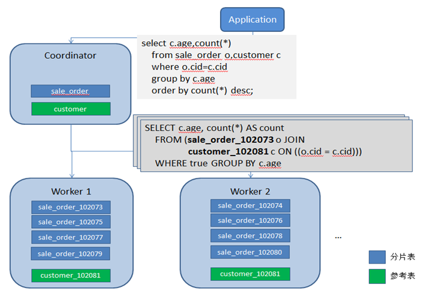
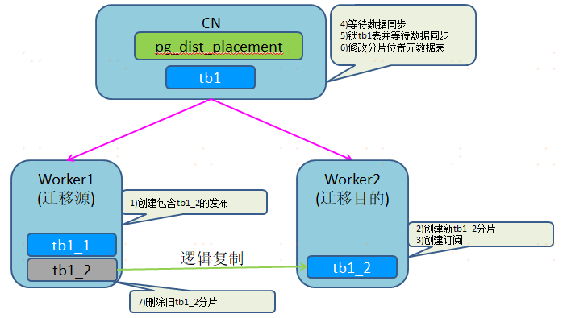
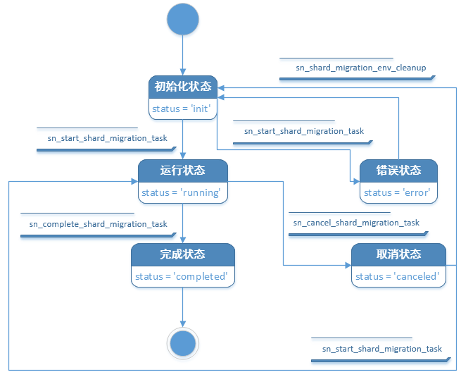

cigration是一个由一系列工具函数组成的PostgreSQL扩展，主要用于执行Citus的在线分片迁移，可用于Citus集群扩容和缩容场景。cigration是`Citus` + `migration`的拼写。

## 1. 使用场景

Citus的分片表由CN上的一个逻辑表和分布在各个Worker上的若干分片组成，当进行集群扩缩容等操作时，可以通过迁移分片来实现。



具体支持的场景和操作步骤如下

### 1.1 扩容

1. 添加新的worker节点到Citus集群
2. 从既有worker节点迁移部分分片到新worker节点，使得分片部署均衡

### 1.2 缩容

1. 从将被缩容掉的Worker迁出所有分片
2. 从Citus集群删除Worker

### 1.3 Worker节点替换

当需要用新机器替换掉某个Worker时，也可以通过迁移分片实现。比如某个Worker节点的机器故障频发需要替换。

1. 添加新的worker节点到Citus集群
2. 把准备下线的Worker节点上所有分片都迁移到新加入的Worker
3. 从Citus集群删除准备下线的Worker


## 2. 技术原理

cigration的主要功能就是在Citus Worker节点间在线迁移分片，迁移过程中产生的更新通过逻辑订阅机制进行同步，仅在更新元数据时的瞬间阻塞业务写入。单个分片的迁移过程如下



为了确保迁移不破坏分片表的亲和关系，互相亲和的一组分片需要同时迁移。

另外，对一次扩容或者缩容作业，需要迁移大量分片，如果人工一个分片一个分片迁移是非常繁琐的，cigration简化了这些操作。迁移时首先会对一个扩容或者缩容作业(job)生成所需的若干迁移任务(task)，每个迁移任务是最小的分片迁移单位，包含一组互相亲和的分片。然后通过调度这些迁移任务最终完成扩容或者缩容作业。

迁移过程中，每个分片迁移任务的状态变化如下所示



注：上的`sn_`前缀实际应该是`cigration_`前缀

对于中途出错的任务，可以通过调用函数`cigration_cleanup_error_env()`，将其变回到初始的init状态，再继续执行。


## 3. 适用条件

### 3.1 软件依赖

- PostgreSQL10+
- Citus 9.2+
- dblink(仅CN节点)

### 3.2 配置依赖

- 所有节点的WAL级别为logical

  postgresql.conf:

  ```
  wal_level = 'logical'
  ```

- 所有节点间（包括备节点）可免密互相访问且支持本机免密访问，比如

  pg_hba.conf:

  ```
  host    all             all            127.0.0.1/32           trust
  host    all             all            ${node1_ip}/32         trust
  host    all             all            ${node2_ip}/32         trust
  host    all             all            ${node3_ip}/32         trust
  ...
  ```

- 所有节点的PATH环境变量包含PostgreSQL安装目录，比如

  ~postgres/.bash_profile:

  ```
  export PATH=/usr/pgsql-12/bin:$PATH
  ```

### 3.3 迁移对象

- 仅支持单副本hash分片表的迁移，即以下表不在支持范围内
  - 参考表
  - 多副本分片表
  - append分片表
  - unlogged表


## 4. 插件安装

在Citus的CN节点安装Citus分片迁移工具插件

```
git clone https://github.com/cloud-sn2/cigration
cd cigration
make install
```

执行`make install`时需要确保PATH路径中包含PostgreSQL安装路径，并拥有安装文件权限，比如使用下面形式。

```
sudo PATH=/usr/pgsql-12/bin:$PATH make install
```

`make install`方式安装时依赖postgresql的devel包，如果没有安装devel包，也可以直接通过拷贝文件的方式安装cigration,比如

```
sudo cp cigration.control cigration--*.sql /usr/pgsql-12/share/extension/
```

连接到CN节点安装cigration扩展

```
SET citus.enable_ddl_propagation TO off;

create extension if not exists dblink;
create extension cigration;

RESET citus.enable_ddl_propagation;
```

**注意**

安装完cigration之后，原来Citus中的`create_distributed_table()`将无法继续使用，需要替换成`cigration.cigration_create_distributed_table()`。


## 5. 操作示例

下面以扩容Worker节点为例介绍cigration的使用方法。

### 5.1 环境准备

初始时，Citus集群包含以下2个worker节点。

- worker1:5432
- worker2:5432

假设数据库中，包含下面2个互相亲和的分片表

```
create table tb1(c1 int primary key, c2 int);
create table tb2(c1 int primary key, c2 int);

set citus.shard_count=8;
select cigration.cigration_create_distributed_table('tb1','c1',colocate_with=>'none');
select cigration.cigration_create_distributed_table('tb2','c1',colocate_with=>'tb1');

insert into tb1 select generate_series(1,100000), 0;
insert into tb2 select generate_series(1,100000), 0;
```

### 5.2 扩容

扩容前，所有分片均匀的分布在2个worker上，如下

```
postgres=#
select nodename,
       nodeport,
       logicalrelid,
       p.shardid
from pg_dist_shard_placement p
     join pg_dist_shard s on(p.shardid = s.shardid)
order by nodename,nodeport,logicalrelid,p.shardid;
 nodename | nodeport | logicalrelid | shardid
----------+----------+--------------+---------
 worker1  |     5432 | tb1          |  102008
 worker1  |     5432 | tb1          |  102010
 worker1  |     5432 | tb1          |  102012
 worker1  |     5432 | tb1          |  102014
 worker1  |     5432 | tb2          |  102016
 worker1  |     5432 | tb2          |  102018
 worker1  |     5432 | tb2          |  102020
 worker1  |     5432 | tb2          |  102022
 worker2  |     5432 | tb1          |  102009
 worker2  |     5432 | tb1          |  102011
 worker2  |     5432 | tb1          |  102013
 worker2  |     5432 | tb1          |  102015
 worker2  |     5432 | tb2          |  102017
 worker2  |     5432 | tb2          |  102019
 worker2  |     5432 | tb2          |  102021
 worker2  |     5432 | tb2          |  102023
(16 rows)
```

#### 5.2.1 添加worker

添加一个新的worker到集群中

```
select master_add_node('worker3',5432);
```

### 5.2.2 创建一个再平衡作业

新worker节点加入Citus集群后，已有的分片并不会自动部署上去，即此时Citus集群中的分片部署是不均衡的。可以创建一个分片再平衡的作业。

```
select * from cigration.cigration_create_rebalance_job();
```

函数返回生成的迁移作业的jobid和这个作业包含的迁移任务，如下

```
-[ RECORD 1 ]---------------+----------------
jobid                       | 1
taskid                      | 1
all_colocated_shards_id     | {102014,102022}
source_nodename             | worker1
source_nodeport             | 5432
target_nodename             | worker3
target_nodeport             | 5432
total_shard_count           | 2
total_shard_size            | 917504
-[ RECORD 2 ]---------------+----------------
jobid                       | 1
taskid                      | 2
all_colocated_shards_id     | {102023,102015}
source_nodename             | worker2
source_nodeport             | 5432
target_nodename             | worker3
target_nodeport             | 5432
total_shard_count           | 2
total_shard_size            | 917504
```

查看生成的job详细

```
select * from cigration.pg_citus_shard_migration order by jobid,taskid;
```

这个job包含2个分片迁移任务

```
-[ RECORD 1 ]---------------+---------------------------
jobid                       | 1
taskid                      | 1
source_nodename             | worker1
source_nodeport             | 5432
target_nodename             | worker3
target_nodeport             | 5432
status                      | init
colocationid                | 1
all_colocated_shards_id   | {102014,102022}
all_colocated_shards_size | {458752,458752}
all_colocated_logicalrels | {public.tb1,public.tb2}
total_shard_count           | 2
total_shard_size            | 917504
create_time                 | 2021-02-12 23:18:14.897657
start_time                  |
end_time                    |
error_message               |
-[ RECORD 2 ]---------------+---------------------------
jobid                       | 1
taskid                      | 2
source_nodename             | worker2
source_nodeport             | 5432
target_nodename             | worker3
target_nodeport             | 5432
status                      | init
colocationid                | 1
all_colocated_shards_id   | {102023,102015}
all_colocated_shards_size | {458752,458752}
all_colocated_logicalrels | {public.tb2,public.tb1}
total_shard_count           | 2
total_shard_size            | 917504
create_time                 | 2021-02-12 23:18:14.897657
start_time                  |
end_time                    |
error_message               |
```

### 5.2.3 执行迁移作业

执行前面生成的作业

```
select cigration.cigration_run_shard_migration_job();
```

函数执行过程中会实时输出迁移进度

```
NOTICE:  2021-02-12 23:26:40.180901+08 [1/2] migration task 1 completed. (processed/total/percent: 896 kB/1792 kB/50 %)
NOTICE:  2021-02-12 23:26:46.555735+08 [2/2] migration task 2 completed. (processed/total/percent: 1792 kB/1792 kB/100 %)
 cigration_run_shard_migration_job
-----------------------------------
 t
(1 row)
```

迁移作业完成后，再次查看分片位置，分片已经部署到新加的worker上了。

```
postgres=# select nodename,
       nodeport,
       logicalrelid,
       p.shardid
from pg_dist_shard_placement p
     join pg_dist_shard s on(p.shardid = s.shardid)
order by nodename,nodeport,logicalrelid,p.shardid;
 nodename | nodeport | logicalrelid | shardid
----------+----------+--------------+---------
 worker1  |     5432 | tb1          |  102008
 worker1  |     5432 | tb1          |  102010
 worker1  |     5432 | tb1          |  102012
 worker1  |     5432 | tb2          |  102016
 worker1  |     5432 | tb2          |  102018
 worker1  |     5432 | tb2          |  102020
 worker2  |     5432 | tb1          |  102009
 worker2  |     5432 | tb1          |  102011
 worker2  |     5432 | tb1          |  102013
 worker2  |     5432 | tb2          |  102017
 worker2  |     5432 | tb2          |  102019
 worker2  |     5432 | tb2          |  102021
 worker3  |     5432 | tb1          |  102014
 worker3  |     5432 | tb1          |  102015
 worker3  |     5432 | tb2          |  102022
 worker3  |     5432 | tb2          |  102023
(16 rows)
```

### 5.2.4 清理回收站

上面的迁移作业完成后，旧的分片并没有被实际删掉，而只是移到了schema名称为`cigration_recyclebin_$job`的回收站里。这是出于安全的考虑，万一迁移出现问题还可以把旧的分片数据找回来。可以通过以下SQL查看回收站的内容。

```
select * from cigration.cigration_get_recyclebin_metadata();
```

在确认分片迁移无误后（比如平稳运行一段时间后），可以把这些旧分片清理掉。

```
select cigration.cigration_cleanup_recyclebin();
```


## 5.3 缩容

### 5.3.1  迁移分片

从待下线节点(worker3)上迁走所有分片

```
select * from cigration.cigration_create_drain_node_job(array['worker3:5432']);
select cigration.cigration_run_shard_migration_job();
```

### 5.3.2 删除worker

从Citus集群删除准备下线的节点(worker3)

```
select master_remove_node('worker3',5432);
```


### 5.4 Worker节点替换

假设需要将worker1替换成worker3，执行步骤如下：

### 5.4.1 添加新worker

添加新的worker节点(worker3)到Citus集群

```
select master_add_node('worker3',5432);
```

### 5.4.2 迁移分片

把准备下线的Worker节点(worker1)上所有分片都迁移到新加入的Worker节点(worker3)

```
select * from cigration.cigration_create_move_node_job('worker1',5432,'worker3',5432);
select cigration.cigration_run_shard_migration_job();
```

### 5.4.3 删除旧worker

从Citus集群删除准备下线的Worker节点(worker3)

```
select master_remove_node('worker1',5432);
```


## 6. 并行迁移

cigration执行迁移作业时串行执行每个迁移任务，当我们扩容或缩容多个worker迁移时间会比较长。为提升分片迁移速度，我们可以创建多个互不冲突的迁移作业，再同时执行这些迁移作业。这里的"互不冲突"，指迁移作业涉及的worker节点没有交集，即需要把worker节点分成多个组。使用示例如下

### 6.1 扩容迁移

在2个worker(worker1,worker2)的Citus集群上再添加2个worker(worker3,worker4)。

#### 6.1.1 创建迁移作业

- 作业1：将worker1上的分片均衡到 worker1 + worker3上
- 作业2：将worker2上的分片均衡到 worker2 + worker4上

```
select cigration.cigration_create_general_shard_migration_job(array['worker1:5432'],
                                                              array['worker1:5432','worker3:5432']);

select cigration.cigration_create_general_shard_migration_job(array['worker2:5432'],
                                                              array['worker2:5432','worker4:5432']);
```

### 6.1.2 执行迁移作业

带入上面函数返回的jobid，在2个会话中分别执行分片迁移作业

**会话1：**

```
select cigration.cigration_run_shard_migration_job($jobid1);
```

**会话2：**

```
select cigration.cigration_run_shard_migration_job($jobid2);
```

### 6.1.3 清空回收站

```
select cigration.cigration_cleanup_recyclebin();
```


### 6.2 缩容迁移

在4个worker（worker1~worker4）的Citus集群上缩容掉2个worker(worker3,worker4)。

#### 6.2.1 创建迁移作业

- 作业1：将worker3上的分片迁移到 worker1上
- 作业2：将worker4上的分片迁移到 worker2上

```
select cigration.cigration_create_general_shard_migration_job(array['worker3:5432'],
                                                              array['worker1:5432']);

select cigration.cigration_create_general_shard_migration_job(array['worker4:5432'],
                                                              array['worker2:5432']);
```

### 6.2.2 执行迁移作业

带入上面函数返回的jobid，在2个会话中分别执行分片迁移作业

**会话1：**

```
select cigration.cigration_run_shard_migration_job($jobid1);
```

**会话2：**

```
select cigration.cigration_run_shard_migration_job($jobid2);
```


### 6.3 worker替换

将2个worker(worker1,worker2)替换为2个新的worker(worker3,worker4)。

#### 6.3.1 创建迁移作业

- 作业1：将worker1上的分片迁移到 worker3上
- 作业2：将worker2 上的分片迁移到 worker4上

```
select cigration.cigration_create_general_shard_migration_job(array['worker1:5432'],
                                                              array['worker3:5432']);

select cigration.cigration_create_general_shard_migration_job(array['worker2:5432'],
                                                              array['worker4:5432']);
```

### 6.3.2 执行迁移作业

带入上面函数返回的jobid，在2个会话中分别执行分片迁移作业

**会话1：**

```
select cigration.cigration_run_shard_migration_job($jobid1);
```

**会话2：**

```
select cigration.cigration_run_shard_migration_job($jobid2);
```


## 7. 函数定义

**主要函数一览**

| 函数分类                        | **函数名称**                            | **描述**                                    |
| --------------------------------------- | ------------ | --------------------------------------- |
| 创建分片表 | cigration_create_distributed_table | 创建分片表 |
| 创建分片表 | cigration_create_distributed_table_with_placement | 在指定worker节点上创建分片表 |
| 生成迁移作业     | cigration_create_rebalance_job                    | 创建均衡分片的迁移作业                             |
| 生成迁移作业 | cigration_create_drain_node_job | 创建排干指定worker上所有分片的迁移作业 |
| 生成迁移作业    | cigration_create_move_node_job                    | 创建迁移指定worker上所有分片到另一worker的迁移作业 |
| 生成迁移作业 | cigration_create_general_shard_migration_job | 创建通用的分片迁移作业             |
| 调度迁移作业 | cigration_run_shard_migration_job     | 执行分片迁移作业                            |
| 调度迁移作业 | cigration_cancel_shard_migration_job | 取消分片迁移作业 |
| 调度迁移作业 | cigration_cleanup_error_env | 清理分片迁移失败后的残留环境 |
| 管理回收站     | cigration_get_recyclebin_metadata | 查看回收站                               |
| 管理回收站 | cigration_cleanup_recyclebin | 清空回收站 |


### 7.1 创建分片表函数

#### 7.1.1 `cigration_create_distributed_table()`

功能：创建分片表

参数：

- table_name regclass
- distribution_column text
- distribution_type citus.distribution_type DEFAULT 'hash'
- colocate_with text DEFAULT 'default'

返回值：void

说明：接口完全兼容Citus原生的`create_distributed_table`，功能上只是增加了是否有迁移作业的检查。


#### 7.1.2 `cigration_create_distributed_table_with_placement()`

功能：在指定worker节点上创建分片表

参数：

- table_name regclass
- distribution_column text
- nodenames text[]
- nodeports integer[]

返回值：void

说明：在指定worker节点上创建分片表。用于一些特殊的场景，比如分布单分片表到不同worker和多租户部署。


### 7.2 生成迁移作业函数

#### 7.2.1 `cigration_create_rebalance_job()`

功能：  创建均衡分片的迁移作业

参数：无

返回值：返回生成的迁移任务记录。记录类型如下

```
TABLE(jobid integer,taskid integer,all_colocated_shards_id bigint[],source_nodename text,source_nodeport integer,target_nodename text,target_nodeport integer,total_shard_count int,total_shard_size bigint)
```

说明：创建均衡分片的迁移作业，主要用于扩容场景。


#### 7.2.2 `cigration_create_drain_node_job()`

功能：  创建排干指定worker节点上所有分片的迁移作业

参数：

- input_source_nodes text[]

返回值：返回生成的迁移任务记录。记录类型如下

```
TABLE(jobid integer,taskid integer,all_colocated_shards_id bigint[],source_nodename text,source_nodeport integer,target_nodename text,target_nodeport integer,total_shard_count int,total_shard_size bigint)
```

说明： 创建排干指定worker节点上所有分片的迁移作业，主要用于缩容场景。


#### 7.2.3 `cigration_create_move_node_job()`

功能：  创建排干指定worker节点上所有分片的迁移作业

参数：

- input_source_nodename text,
- input_source_nodeport integer
- input_target_nodename text
- input_target_nodeport integer

返回值：返回生成的迁移任务记录。记录类型如下

```
TABLE(jobid integer,taskid integer,all_colocated_shards_id bigint[],source_nodename text,source_nodeport integer,target_nodename text,target_nodeport integer,total_shard_count int,total_shard_size bigint)
```

说明： 创建排干指定worker节点上所有分片的迁移作业，主要用于缩容场景。


#### 7.2.4 `cigration_create_general_shard_migration_job()`

功能：  创建通用的分片迁移作业

参数：

- source_nodes text[]
- target_nodes text[]
- input_target_nodename text
- input_target_nodeport integer

返回值：integer。返回生成的迁移作业的jodid

说明： 指定迁移的源worker节点和目的worker节点集合，生成迁移作业，使得源worker节点上的所有分片均匀地分布到目的worker节点上。源worker节点和目的worker节点集合可以有交集。


### 7.3 调度迁移作业函数

#### 7.3.1 `cigration_run_shard_migration_job()`

功能：  运行分片迁移作业

参数：

- jobid_input int default NULL

  当只有唯一一个迁移作业时，可以省略jobid，用NULL代替。

- taskids int[] default NULL

  NULL代表该jobid包含地所有任务

- init_sync_timeout int default 7200

  初始数据同步的最大时间，单位秒。单个迁移任务涉及地数据量很大时，需要调大这个参数。

- longtime_tx_threshold interval default '30 min'

  存在长事务时可能导致初始时间过长，该参数指定启动迁移任务时检查的长事务阈值。

- with_replica_identity_check boolean default false

  是否检查无主键或无`replica_identity`的表。

返回值：boolean。执行成功返回true，失败返回false

说明： 顺序执行分片迁移作业中地所有任务。


#### 7.3.2 `cigration_cancel_shard_migration_job()`

功能： 取消已经运行的分片迁移作业

参数：

- jobid_input int default NULL

  当只有唯一一个迁移作业时，可以省略jobid，用NULL代替。

- taskid_input int default null

  NULL代表该jobid包含地所有任务

返回值：boolean。执行成功返回true，失败返回false

说明： 当需要取消一个运行中的迁移作业时，需要先通过CTRL-C停止运行迁移作业的SQL（如果无法在运行迁移作业的原会话上执行CTRL-C，可以使用`pg_terminate_backend() `），再调用本函数。取消后的迁移作业将会从任务列表中删除，如果希望继续迁移分片，需要重新创建分片迁移作业。


#### 7.3.3 `cigration_cleanup_error_env()`

功能：清理分片迁移失败后的残留环境

参数：void

返回值：void

说明： 当迁移作业中的任务运行失败时，其状态会变成'error'无法继续执行。排除错误后，调用本函数清理分片迁移失败后的残留环境会使任务恢复到初始状态。然后可以继续调用`cigration_run_shard_migration_job()`重新开始迁移作业。当有多个迁移作业时，必须所有迁移作业都停止的情况下，才可以执行该函数。


### 7.4 管理回收站函数

#### 7.4.1 `cigration_get_recyclebin_metadata()`

功能：查看残留在各个worker上的回收站schema一览

参数：void

返回值：TABLE(nodename text, nodeport int, schema_name text)

说明： 输出残留在各个worker上的回收站schema一览


#### 7.4.2 `cigration_cleanup_recyclebin()`

功能：清空各个worker上残留的回收站

参数：

- jobid_input integer default null

返回值：void

说明： 清空jobid_input对应的回收站；jobid_input为null时，清空各个worker上残留的所有回收站。


## 8. 管理表定义

为了管理分片迁移，cigration中使用了一些内部表存储元数据。通过查询这些表我们可以了解每个迁移任务的状态，以及在出现问题后可以帮助定位原因。

**管理表一览**

| 表名                             | 描述               |
| -------------------------------- | ------------------ |
| pg_citus_shard_migration         | 分片迁移任务表     |
| pg_citus_shard_migration_history | 历史分片迁移任务表 |
| pg_citus_shard_migration_sql_log | 分片迁移日志表     |


### 8.1 `cigration.pg_citus_shard_migration`

每个迁移任务的信息，示例如下：

```
-[ RECORD 1 ]---------------+---------------------------
jobid                       | 1
taskid                      | 1
source_nodename             | worker1
source_nodeport             | 5432
target_nodename             | worker3
target_nodeport             | 5432
status                      | init
colocationid                | 1
all_colocated_shards_id   | {102014,102022}
all_colocated_shards_size | {458752,458752}
all_colocated_logicalrels | {public.tb1,public.tb2}
total_shard_count           | 2
total_shard_size            | 917504
create_time                 | 2021-02-12 23:18:14.897657
start_time                  |
end_time                    |
error_message               | 
```

每个任务有5种状态(status)

- init
  - 初始任务状态
- running
  - 运行中的任务
- completed
  - 执行完成的任务
- error
  - 中途出错的任务。调用`cigration_cleanup_recyclebin()`做清理操作后，可以回到init状态，继续执行。
- canceled
  - 被主动取消的任务。可以调用`cigration_run_shard_migration_job`或`cigration_start_shard_migration_task()`继续执行。

### 8.2 `cigration.pg_citus_shard_migration_history`

迁移完成的任务记录最后会从`cigration.pg_citus_shard_migration`表移动到`cigration.pg_citus_shard_migration_history`。示例如下：

```
-[ RECORD 1 ]---------------+---------------------------
jobid                       | 1
taskid                      | 1
source_nodename             | worker1
source_nodeport             | 5432
target_nodename             | worker3
target_nodeport             | 5432
status                      | completed
colocationid                | 1
all_colocated_shards_id   | {102014,102022}
all_colocated_shards_size | {458752,458752}
all_colocated_logicalrels | {public.tb1,public.tb2}
total_shard_count           | 2
total_shard_size            | 917504
create_time                 | 2021-02-12 23:18:14.897657
start_time                  | 2021-02-12 23:26:38.889124
end_time                    | 2021-02-12 23:26:40.167982
error_message               | 
```

### 8.3 `cigration.pg_citus_shard_migration_sql_log`

这个表记录，迁移过程中cigration发送给worker的SQL，主要用于问题诊断。示例如下：

```
-[ RECORD 11 ]---+------------------------------------------------------------------------------------------------------------------------------------------
id               | 15
jobid            | 1
taskid           | 2
execute_nodename | worker2
execute_nodeport | 5432
functionid       | cigration.cigration_move_shard_placement
sql              | CREATE PUBLICATION citus_move_shard_placement_pub FOR TABLE tb1_102015,tb2_102023
execute_time     | 2021-02-12 23:26:40.189126
-[ RECORD 12 ]---+------------------------------------------------------------------------------------------------------------------------------------------
id               | 16
jobid            | 1
taskid           | 2
execute_nodename | worker3
execute_nodeport | 5432
functionid       | cigration.cigration_move_shard_placement
sql              | CREATE SUBSCRIPTION citus_move_shard_placement_sub                                                                                       +
                 |                                          CONNECTION 'host=worker2 port=5432 user=postgres dbname=postgres'                               +
                 |                                          PUBLICATION citus_move_shard_placement_pub with (create_slot = false,slot_name = 'slot_worker3')
execute_time     | 2021-02-12 23:26:40.189126
```


## 9. 注意事项

1. 安装cigration插件后，不能继续使用`create_distributed_table()`,需要替换成`cigration.cigration_create_distributed_table`。

   不过cigration插件只屏蔽了2参的`create_distributed_table()`的调用。如果你不想过多依赖cigration，并且下面的2描述的风险，可以继续使用3参或4参的方式调用`create_distributed_table()`, 比如： 

   ```
   select create_distributed_table('tb1','c1',colocate_with=>'default');
   ```

2. 存在分片迁移作业时，不允许创建指定亲和关系的分片表。

   因为新生成的分片表如果和某个正在迁移的分片表亲和，那么依赖这种亲和关系的业务SQL可能会执行失败。

   有破坏亲和性关系的操作不仅仅是调用 `create_distributed_table()` ，以下场景存在同样问题。

   - 当存在迁移作业时，给已有的分区表添加新的分区子表
   - 当存在迁移作业时，修改亲和关系
     - update_distributed_table_colocation(regclass,text)
  - mark_tables_colocated(regclass,regclass[])
   
3. 存在分片迁移作业时，不允许DROP迁移作业中包含的表。

4. 分片迁移作业运行期间，CN上不允许执行以下DDL。

   - ALTER TABLE
   - CREATE INDEX
   - ALTER INDEX
   - DROP INDEX

5. 分片迁移任务开始时，不能有长事务（默认指运行时间30分钟以上的事务）

6. 对于没有主键且没有设置`replica identity`的表，分片迁移期间无法执行update和delete。这是逻辑复制的限制，可等迁移作业完成或取消迁移作业后，再对表设置`replica identity`回避。

   ```
   alter table 表名 replica identity using INDEX 唯一索引名
   ```

   或

   ```
   alter table 表名 replica identity full
   ```

7. PG10的逻辑复制只支持insert，delete和update，不支持truncate。因此在PG10上，分片迁移的同时执行truncate可能导致数据不一致。

8. HA切换会影响正在执行的迁移作业


## 10. 使用提示

1. 迁移性能提升

   通过以下2种方法，可提升迁移时拷贝数据的并行度，达到提升迁移性能的效果。

   - 使用并行迁移
   - 增加`max_sync_workers_per_subscription`参数值，提升逻辑复制初始数据同步的速度。

2. 亲和关系定制

   一个亲和组代表一个原子迁移任务。Citus默认(即colocate_with=>'default')根据分片数，副本数和数据类型设置亲和关系，这可能导致导致单个迁移过大。在已知业务表的使用方式的情况下，建议显式指定亲和关系，比如。

   ```
   select cigration.cigration_create_distributed_table('tb1','c1',colocate_with=>'none');
   select cigration.cigration_create_distributed_table('tb2','c1',colocate_with=>'tb1');
   ```

   对已有的分片表，如果后期发现亲和关系设置不当，也可使用citus工具函数修改亲和关系
   
   - update_distributed_table_colocation(regclass,text)
   - mark_tables_colocated(regclass,regclass[])

3. DDL限制回避

   如果由于存在迁移作业导致部分DDL或其他操作无法执行，可以先取消迁移作业。DDL执行后再重新创建迁移作业。

